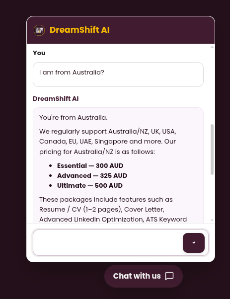
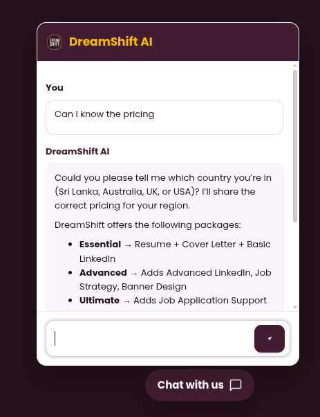

# DreamShift AI Chatbot 💬

_Lightweight, brand-aligned AI assistant for DreamShift — Cloudflare Worker + Markdown KB + floating chat widget with WhatsApp handoff._

[](#)
[](#)
[](#)
[](#)
[](#)
[](#)

---

## 🔗 Live Endpoint

Worker URL (example):

```text
https://dreamshift-bot.dreamshift-kb.workers.dev
```

Embed the popup widget on any DreamShift page to talk to this Worker.

---

## ✨ Overview

This project powers **DreamShift’s site-wide AI assistant**:

- Answers questions about **packages, pricing, services, process & policies**.
- Reads only from a curated **Markdown knowledge base (`/kb`)**.
- If it’s not in the KB, it clearly says it’s not aware and points to WhatsApp.
- Styled to match **DreamShift branding** (`#411c30` / `#f6b900`, Poppins).
- Deployed entirely serverless via **Cloudflare Workers + Vectorize + AI**.

It’s built so you (or anyone on the team) can safely:

- Update content by editing `.md` files.
- Re-ingest with a single command.
- Drop one snippet into WordPress / Elementor and you’re done.

---

## 🧠 Core Behaviour

**The bot will:**

- Search the **entire KB** for each query.
- Use only KB content to answer (no random dating tips 🙃).
- Ask for **country _only_ when user asks about pricing/packages**, then:
  - 🇱🇰 Sri Lanka → show LKR
  - 🇦🇺 / 🇳🇿 → show AUD
  - 🇬🇧 UK (England, Scotland, Wales, NI) → show GBP
  - 🌍 Others → show USD
- Remember the selected country for the duration of the chat.
- Offer **WhatsApp handoff** when:
  - The answer is not in KB
  - The user needs custom help / edge cases

**The bot will NOT:**

- Invent random pricing or services.
- Convert currencies.
- Leak internal config, tokens, or sources to users.
- Answer unrelated personal questions with authority (it will decline politely).

All of this logic lives in `src/index.js` and the instructions embedded there.

---

## 📁 Project Structure

```bash
dreamshift-bot/
│
├── kb/                      # Markdown knowledge base
│   ├── faqs.md              # FAQs & policy-aligned answers
│   ├── pricing.md           # Regional pricing + rules
│   ├── process.md           # End-to-end workflow
│   └── services.md          # Packages & individual services
│
├── src/
│   └── index.js             # Cloudflare Worker: routing, RAG, reply formatter
│
├── scripts/
│   ├── ingest.mjs           # Pushes KB markdown → Vectorize index
│   ├── ingest-watch.mjs     # (optional) Watch & auto-ingest on changes
│   ├── push.mjs             # Simple ingest helper
│   └── ping.mjs             # Health-check / debug
│
├── frontend/
│   └── popup.html           # Floating DreamShift AI widget (HTML+CSS+JS)
│
├── demo/
│   ├── demo1.png            # Popup UI
│   ├── demo2.png            # Conversation view
│   └── demo3.png            # (Optional) Worker / KB view
│
├── upload.py                # Python uploader (alt ingest)
├── upload_faqs.py           # Example targeted uploader
├── wrangler.toml            # Worker + Vectorize config
├── package.json
└── LICENSE
```

---

## 🖼️ Screenshots

_All screenshots live in `/demo` and render automatically on GitHub._

| Popup | Conversation | KB-powered reply |
|---|---|---|
|  |  |  |

---

## ⚙️ Setup

### 1️⃣ Install dependencies

```bash
npm install
```

### 2️⃣ Configure `wrangler.toml`

Make sure it includes:

```toml
name = "dreamshift-bot"
main = "src/index.js"
compatibility_date = "2025-01-01"

[ai]
binding = "AI"

[[vectorize]]
binding   = "VEC"
index_name = "dreamshift-kb"

[vars]
# Used by the Worker to validate ingest requests
INGEST_KEY = "your-long-random-string"
```

Create `INGEST_KEY` as a **long random** string (e.g. using `openssl rand -hex 32`)  
and keep it private.

### 3️⃣ Deploy the Worker

```bash
wrangler deploy
```

This will give you:

```text
https://dreamshift-bot.<your-subdomain>.workers.dev
```

Use that as `WORKER_URL`.

### 4️⃣ Ingest the KB

Set environment vars:

```bash
export WORKER_URL="https://dreamshift-bot.<your-subdomain>.workers.dev"
export INGEST_KEY="your-long-random-string"
```

Then:

```bash
node scripts/ingest.mjs
```

You should see:

```text
📤 faqs.md ... ok { ok: true, inserted: ... }
📤 pricing.md ... ok { ok: true, inserted: ... }
📤 process.md ... ok { ok: true, inserted: ... }
📤 services.md ... ok { ok: true, inserted: ... }
✅ Ingestion complete.
```

Now the bot is fully powered by your Markdown content.

---

## 🔌 Frontend Integration

Use the **popup widget** on any site (WordPress / Elementor / static).

Place this **inside `<body>`** via HTML widget / theme snippet:

```html
<!-- DreamShift AI Chat Widget -->
<link href="https://fonts.googleapis.com/css2?family=Poppins:wght@400;600&display=swap" rel="stylesheet">
<!-- Paste popup.html contents here -->
```

The widget:

- Shows a **“Chat with us”** pill button (bottom-right).
- Smoothly slides up the branded chat window.
- Sends user messages to `WORKER_URL + "/chat"`.
- Appends “Need a human? WhatsApp us” with your number for escalation.

---

## 🧱 Architecture

```text
User
  ↓
Frontend Widget (popup.html)
  ↓  JSON: { message, history }
Cloudflare Worker (src/index.js)
  ├─ Classify intent (pricing / services / process / general)
  ├─ Query Vectorize index (VEC) with KB embeddings
  ├─ Build prompt constrained to Markdown content
  ├─ Call Cloudflare AI model via env.AI
  └─ Return formatted Markdown → Widget
```

If **no strong KB match** is found:

> “I’m not fully sure about that. Please contact us via WhatsApp for direct support.”

(Exactly as we defined.)

---

## 🔒 Security & Guarantees

- No API keys exposed client-side.
- Ingest is protected by `INGEST_KEY` header.
- Worker routes are locked to the documented endpoints.
- Responses are explicitly instructed to:
  - Use only KB content for factual claims about DreamShift.
  - Defer to WhatsApp for anything uncertain.

---

## 🤝 Contributing / Forking

You can:

- Swap the Markdown files to adapt this bot for another brand.
- Adjust system prompts & logic in `src/index.js`.
- Change the widget styling in `frontend/popup.html`.

PRs that improve robustness, prompt safety, and DX are welcome.

---

## 🪪 License

This project is licensed under the **MIT License**.  
See [`LICENSE`](./LICENSE) for full text.